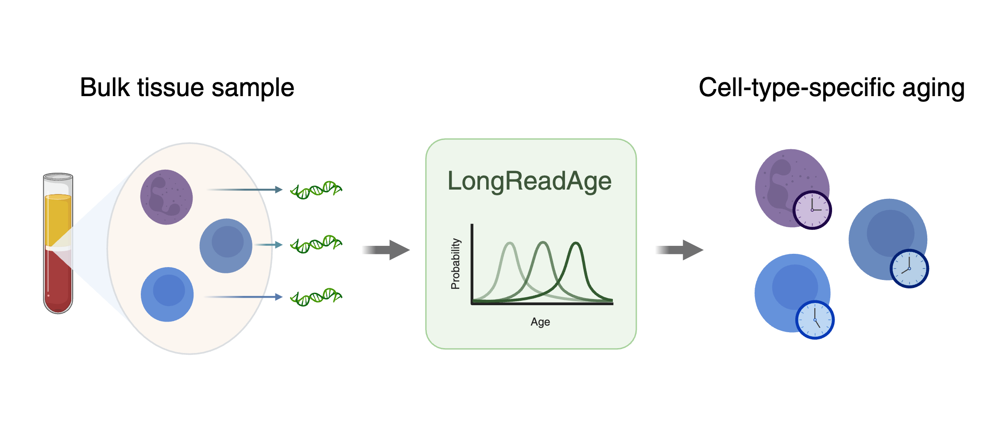

## Profiling epigenetic aging at cell-type resolution through long-read sequencing


### Description

This repository contains code used to generate results associated with the following manuscript: 

Eames, A., Moqri, M., Poganik, J. R., & Gladyshev, V. N. (2025). Profiling epigenetic aging at cell-type resolution through long-read sequencing. *Aging Cell*.

### Dependencies

Python (developed with version 3.12)

R (developed with version 4.0.2)

### Installation

To download a local version of this repository, use the following command:

```         
git clone https://github.com/Gladyshev-Lab/LongReadAge.git
```
